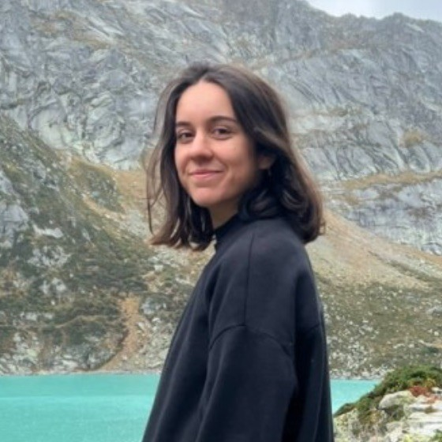

---
# Feel free to add content and custom Front Matter to this file.
# To modify the layout, see https://jekyllrb.com/docs/themes/#overriding-theme-defaults

layout: home
---

#### *PhD student in computational neurosciences* 

 
##### Université de Bretagne Occidentale | LaTIM | BEaCHILD 

Currently doing a PhD in computational neurosciences under the supervision of Sylvain Brochard, Mickaël Dinomais and François Rousseau. I am studying the longitudinal changes on the brains of children aged 1 to 4 with cerebral palsy induced by the HABIT-ILE therapy. This thesis is a part of the European [CAP' project](https://fondationparalysiecerebrale.org/projet-cap/). 

Take a look at my [CV](assets/CV_EL_2025.pdf)!

 
My topics of interest are: 

<ul style='list-style-type: "—  "'>
<li><b>AI for medical imaging</b>: developping deep learning models to extract relevent information from medical images, such as MRIs</li>
<li><b>Structural brain morphometry</b>: using image processing tools such as segmentation to analyse the shape of brain structures</li>
</ul>

___
 

### **Projects**:

  
  

    
    

      {{ project.name }} 
{{ project.description }}

    

  

  

